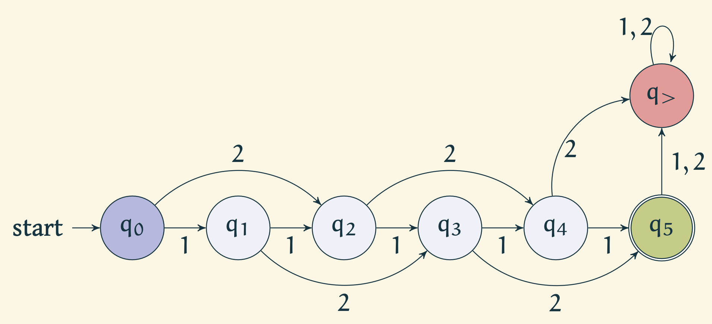
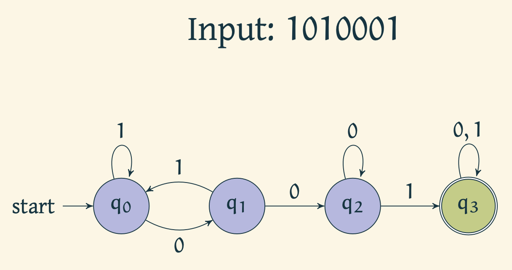
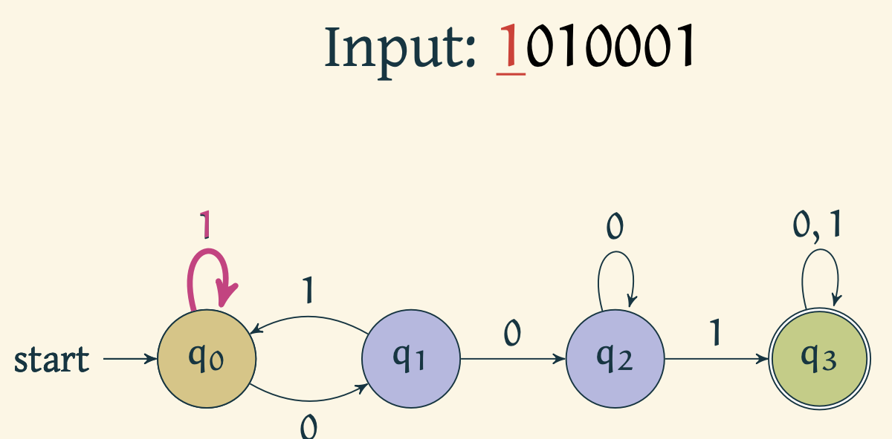
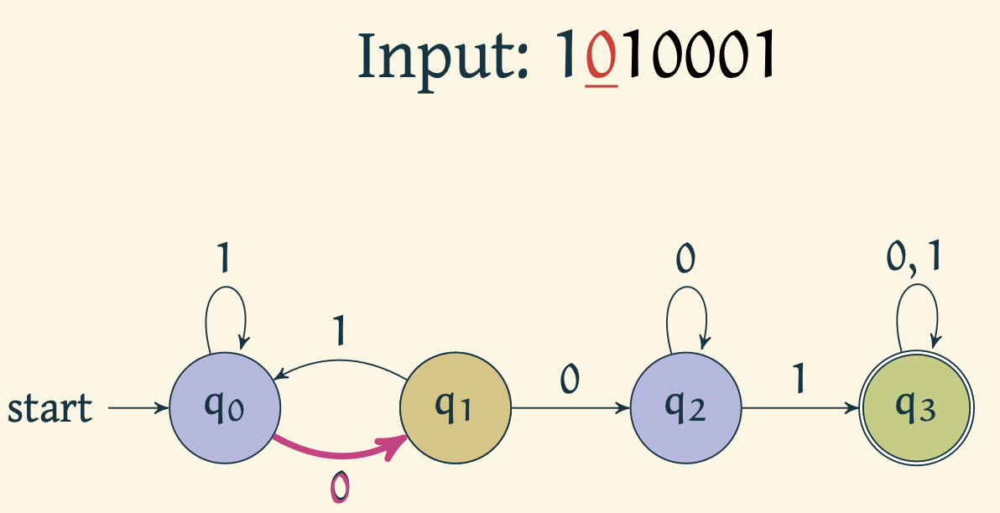
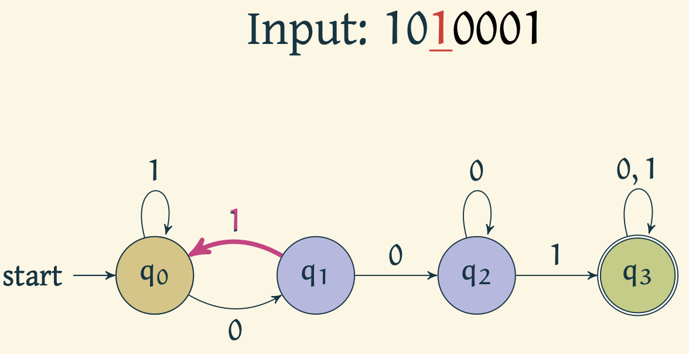
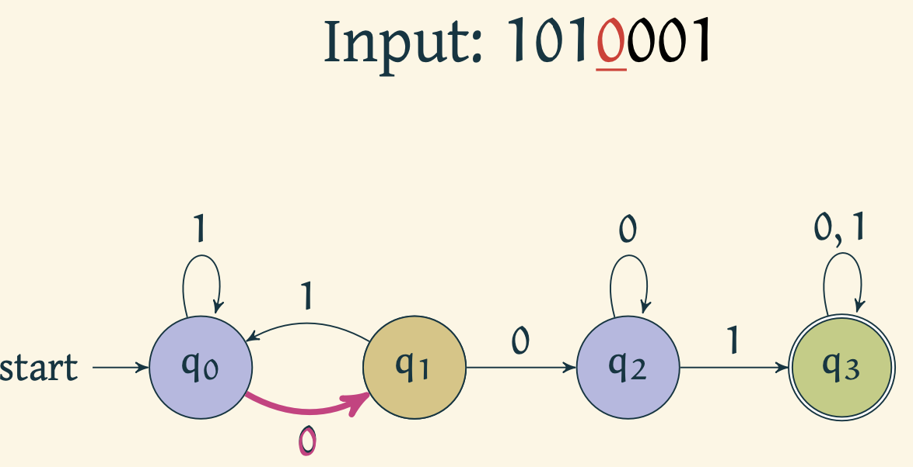
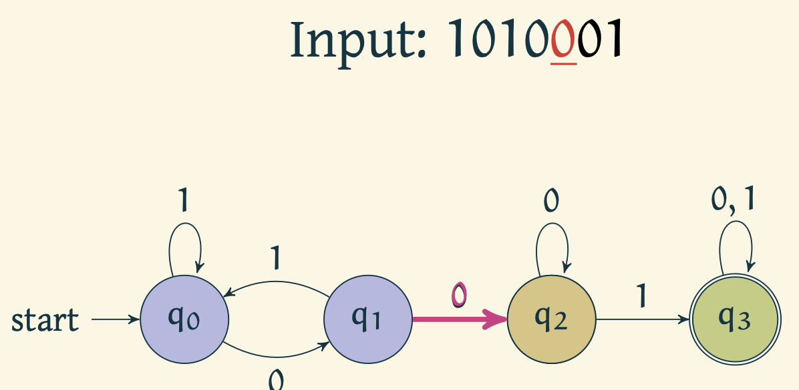
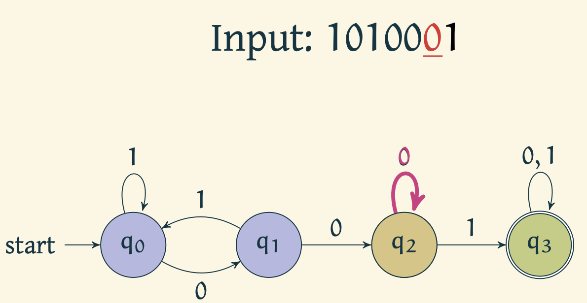
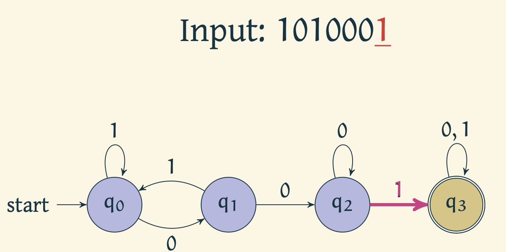

## Introduction

Consider the following example of a very rudimentary vending machine which only takes in 1 and 2 rupee coins as inputs, and all items are identical are priced at 5 rupees each. The vending machine pushes all the coins out if the input coins add up to 6 rupees without first adding up to 5 rupees, or any coin that is input after reaching 5 rupees.

Observe that the machine can be in states 1, 2, 3, 4, 5, and >5 depending on what the sum of coins input so far is. For the machine, the sequence of coins input so far do not matter.

### Abstracting out the machine

Note that the following properties held for the above machine.
- Finite number of states: $\{0,1,2, \ldots, 5, >5\}$
- Well defined input: $\{1,2\}^*$
- Predetermined transition logic
- Start state: $\{0\}$
- Actionable states: $\{5, >5\}$
- No memory of previous states

This is in fact an example of what we call a deterministic finite state machines or finite state automaton. In short, we refer to them as DFAs.

### Formal definition

A *Finite State Machine* (FSM) is a $5$-tuple $(Q, \Sigma, \delta, q_0, F)$ where
- $Q$ is a finite set called *states*,
- $\Sigma$ is a finite set called *alphabet*,
- $\delta: Q\times \Sigma \rightarrow Q$ is the *transition function*,
- $q_0$ is the *start state*, and
- $F\subseteq Q$ is the set of *accept states*.

Afore mentioned rudimentary vending machine can be formalized as follows.
- $Q = \{q_1, q_2, q_3, q_4, q_5, q_{>}\}$
- $\Sigma = \{1,2\}$
- $\delta$ is given by

| | 1 | 2 |
| :--- | :---: | ---:|
| q_0 | q_1 | q_2 |
| q_1 | q_2 | q_3|
| q_2 | q_3 | q_4|
| q_3 | q_4 | q_5|
| q_4 | q_5 | q_{>}|
| q_5 | q_{>} | q_{>}|
| q_{>} | q_{>} | q_{>}|

- $q_0$ is the start state
- $F = \{q_5\}$

<!--  --->

### Run of a Finite State Automaton

