## Introduction

Consider the following example of a very rudimentary vending machine which only takes in 1 and 2 rupee coins as inputs, and all items are identical are priced at 5 rupees each. The vending machine pushes all the coins out if the input coins add up to 6 rupees without first adding up to 5 rupees, or any coin that is input after reaching 5 rupees.

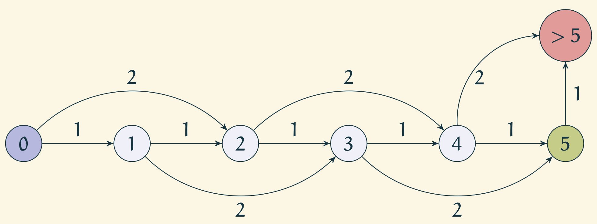

Observe that the machine can be in states 1, 2, 3, 4, 5, and >5 depending on what the sum of coins input so far is. For the machine, the sequence of coins input so far do not matter.

### Abstracting out the machine

Note that the following properties held for the above machine.
- Finite number of states: $ \{0,1,2, \ldots, 5, >5\} $
- Well defined input: $ \{1,2\}^* $
- Predetermined transition logic
- Start state: $ \{0\} $
- Actionable states: $ \{5, >5\} $
- No memory of previous states

This is in fact an example of what we call a deterministic finite state machines or finite state automaton. In short, we refer to them as DFAs.

### Formal definition

A *Deterministic Finite State Machine/Automaton* (DFA) is a $ 5 $-tuple $ (Q, \Sigma, \delta, q_0, F) $ where
- $ Q $ is a finite set called *states*,
- $ \Sigma $ is a finite set called *alphabet*,
- $ \delta: Q\times \Sigma \rightarrow Q $ is the *transition function*,
- $ q_0 $ is the *start state*, and
- $ F\subseteq Q $ is the set of *accept states*.

Afore mentioned rudimentary vending machine can be formalized as follows.
- $ Q = \{q_1, q_2, q_3, q_4, q_5, q_{>}\} $
- $ \Sigma = \{1,2\} $
- $ \delta $ is given by

| | 1 | 2 |
| :--- | :---: | ---:|
| $ q_0 $ | $ q_1 $ | $ q_2 $ |
| $ q_1 $ | $ q_2 $ | $ q_3 $|
| $ q_2 $ | $ q_3 $ | $ q_4 $|
| $ q_3 $ | $ q_4 $ | $ q_5 $|
| $ q_4 $ | $ q_5 $ | $ q_{>} $|
| $ q_5 $ | $ q_{>} $ | $ q_{>} $|
| $ q_{>} $ | $ q_{>} $ | $ q_{>}$|

- $ q_0 $ is the start state
- $ F = \{q_5\} $

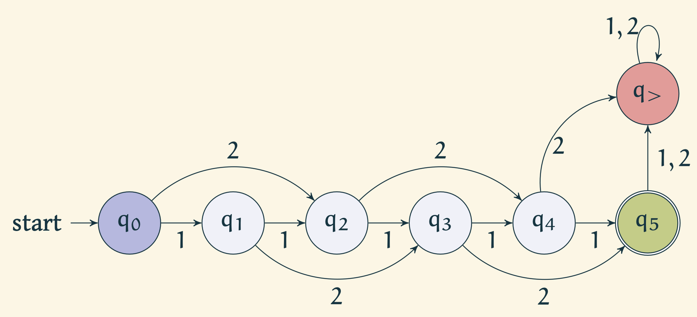

### Run of a Finite State Automaton
Given any string in $ \Sigma^* $, we can simulate the finite state automaton using the predetermined transition function by reading the string bit by bit. Note that the start state is $ q_0 $, and the accept state is $ q_3 $.

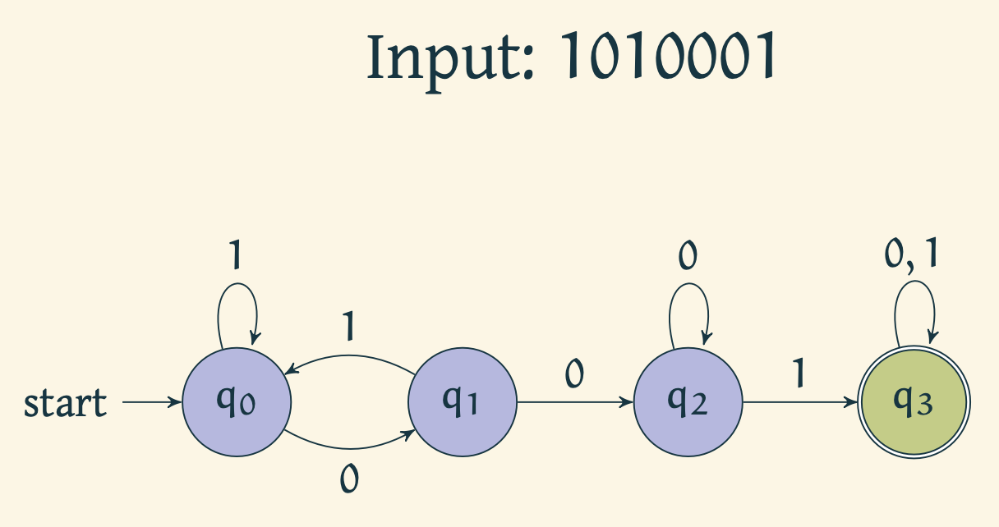

Automaton reads 1 and stays in $ q_0 $.

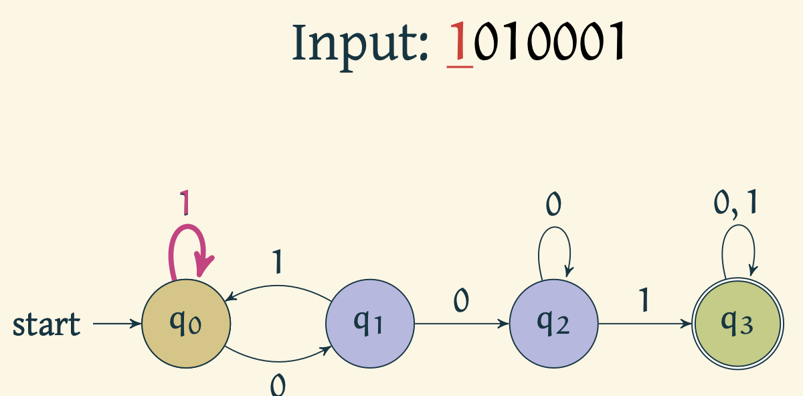

Automaton reads 0 and moves to $ q_1 $

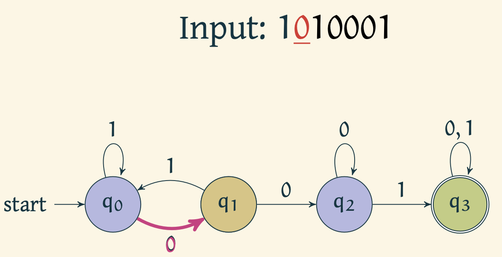

Automaton reads 1 and moves to $ q_0 $

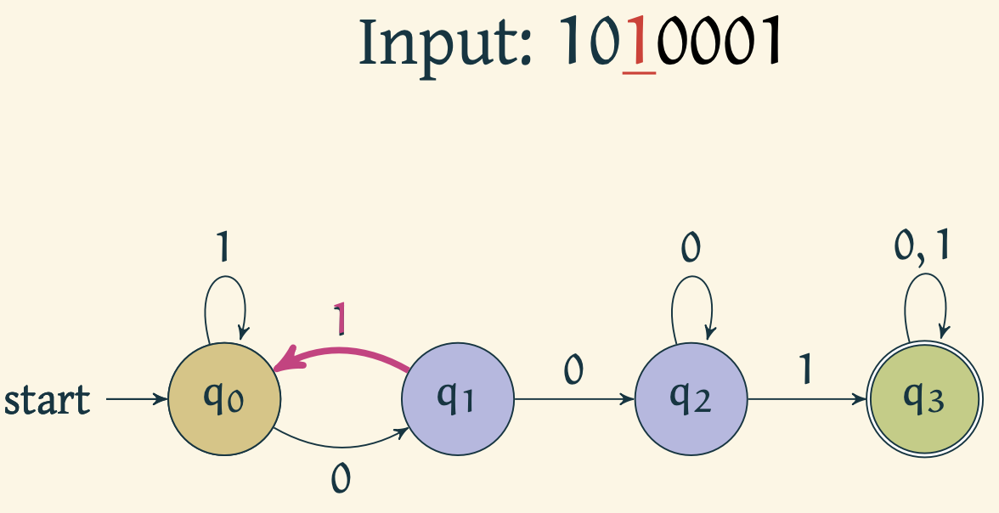

Automaton reads 0 and moves to $ q_1 $

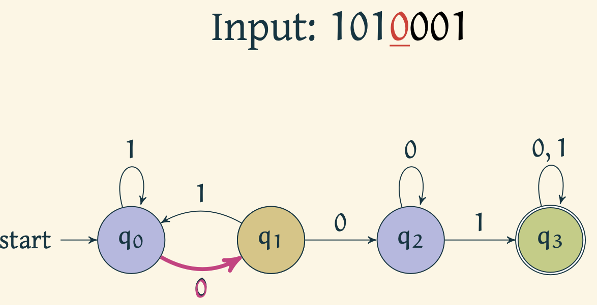

Automaton reads 0 and moves to $ q_2 $

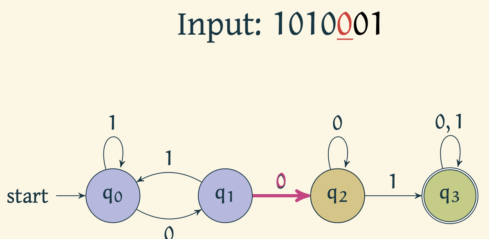

Automaton reads 0 and stays in $ q_2 $

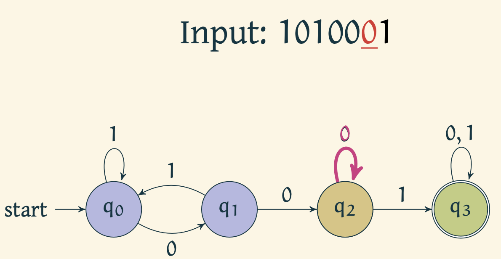

Automaton reads 1 and moves to $ q_3 $

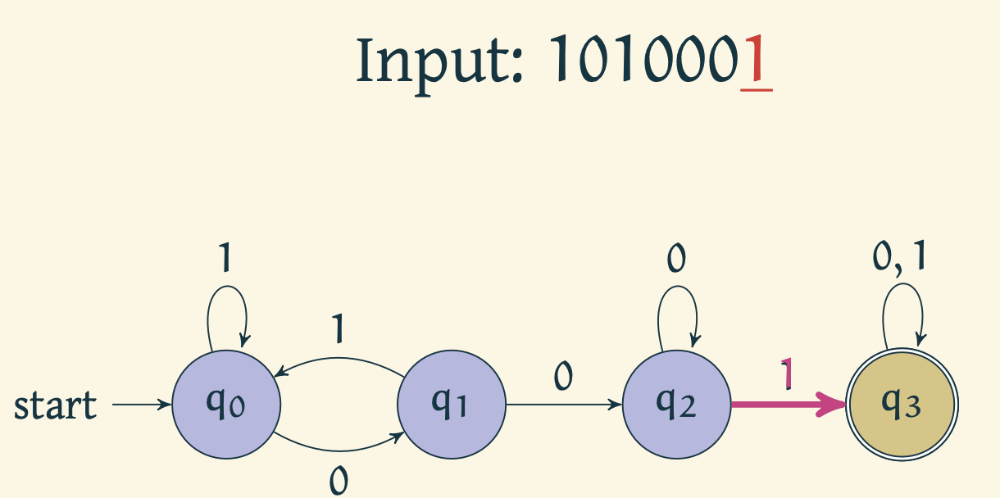

Automaton accepts the string upon reaching $ q_3 $.

### Language acceptance of a finite state automaton

A language is a set of strings over a given alphabet $\Sigma$.

Given a machine $ M = (Q, \Sigma, \delta, q_0, F) $,
- A string $ x $ is *accepted* by machine $M $ if a run of machine $M $ on $x $ ends in an accepting state.
- Language of $ M $, $ L(M) = \{w\in\Sigma^{*}\mid w~\mathrm{is accepted by}~M \} $.
- For a set $ A $ if $ L(M) = A $, then $ M $ *recognizes* $A$.

The above definition does not use the word *deterministic*, and as we shall see in the [next experiment](https://virtual-labs.github.io/exp-non-determinstic-finite-automaton-iiith), this also holds for non-deterministic finite state automata.

*Things to ponder on:* 
1. Given a finite state automaton $ M $, can it happen that it accepts no strings?
2. Given a set of strings over an alphabet $ \Sigma $, is there a DFA that accepts it?

#### Example 2

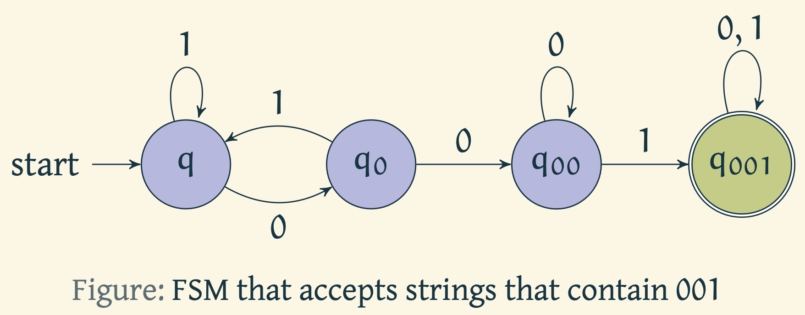

The above automaton recognizes strings that contain 001.

## Related topics
1. [Language acceptance by Non-Deterministic Finite Automata](https://virtual-labs.github.io/exp-non-determinstic-finite-automaton-iiith/)
2. [Converting a NFA to a DFA](https://virtual-labs.github.io/exp-nfa-to-dfa-iiith/)
3. [Converting a Regular Expression to NFA](https://virtual-labs.github.io/exp-converting-regular-expression-iiith/)

